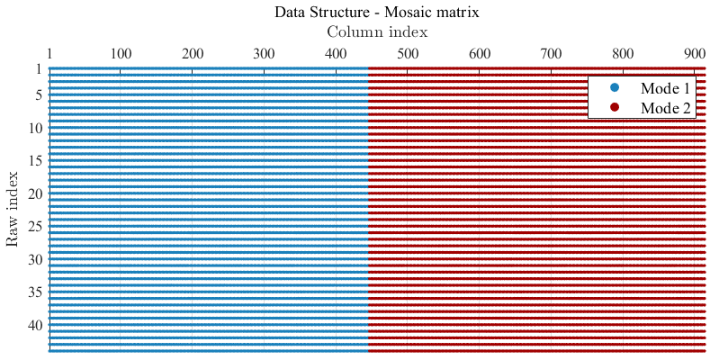

# On the impact of shrinkage in DeePC for Piecewise Affine Systems

Matlab implementation of data-driven control strategies as described in the article
"On the impact of shrinkage in DeePC for Piecewise Affine Systems."

## Prerequisites

You will need:

- `Matlab`
- `Matlab statistics_toolbox` (see https://nl.mathworks.com/products/statistics.html)
- `CVX` (see https://cvxr.com/)
- `Hybrid Toolbox` (see https://cse.lab.imtlucca.it/~bemporad/hybrid/toolbox/)

## Installation

To clone this repository, see https://nl.mathworks.com/help/simulink/ug/clone-git-repository.html

## Example: 

The considered PieceWise Affine (PWA) system is described as follows

```math
\begin{align}
     &x_{t+1} = \begin{cases}
         -0.3 x_t + 1.4 u_t &\text{if}~x_t<0,\\
         0.9 x_t + 0.15 u_t &\text{if}~x_t\geq 0,
\end{cases}\\
 &y_t = x_t,
\end{align}
```
being $x_t \in ℝ$ denotes the state at time $t\in ℤ_{\geq0}$, $u_t \in ℝ$, and $y_t \in ℝ$ indicate the corresponding input and measurable output. Furthermore, we refer to the first state equation as first mode, and to the second state condition as second mode.

Toward interpreting the decision taken by DeePC, we construct a Mosaic matrix from the (raw) input/output data of the system stored in [`Data`](Data) to reflect the differences between the two local behaviors of the PWA system.

<p align="center">
  
</p>

### Lasso-DeePC
The following gifs showcase a reference tracking performed with a Lasso-DeePC formulation jointly with its data selection.


### CAP-DeePC
The following gifs showcase a reference tracking performed with a Lasso-DeePC formulation jointly with its data selection.

## License
TODO: creative commons??


## References
TODO.

